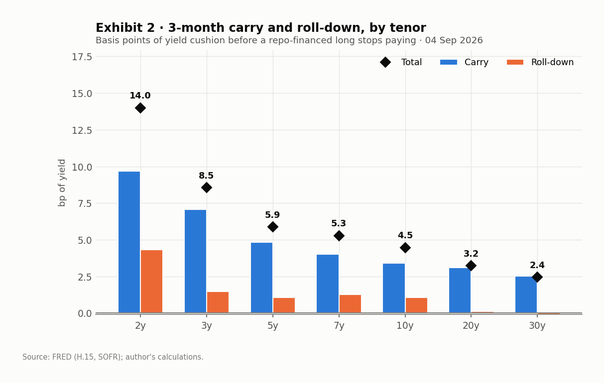
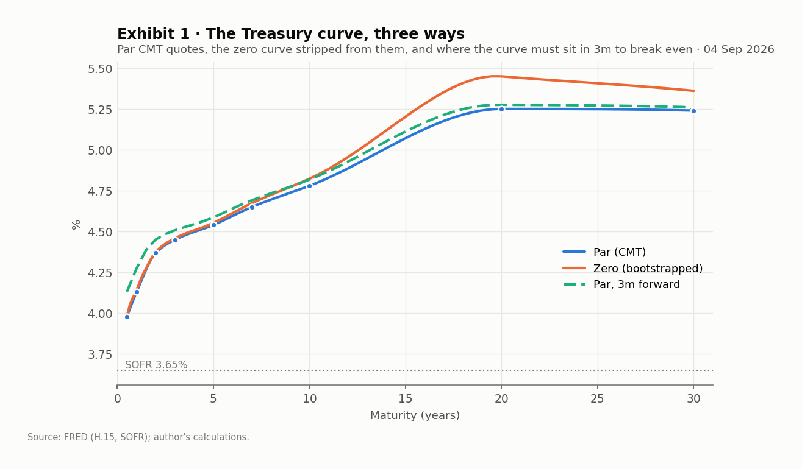
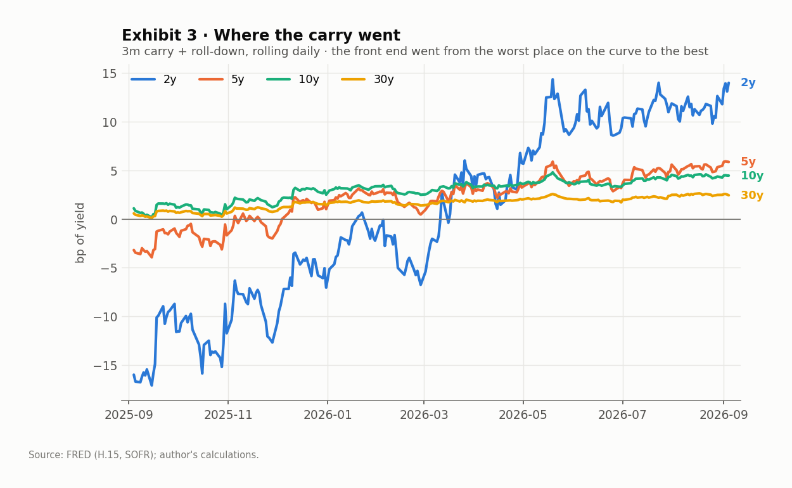
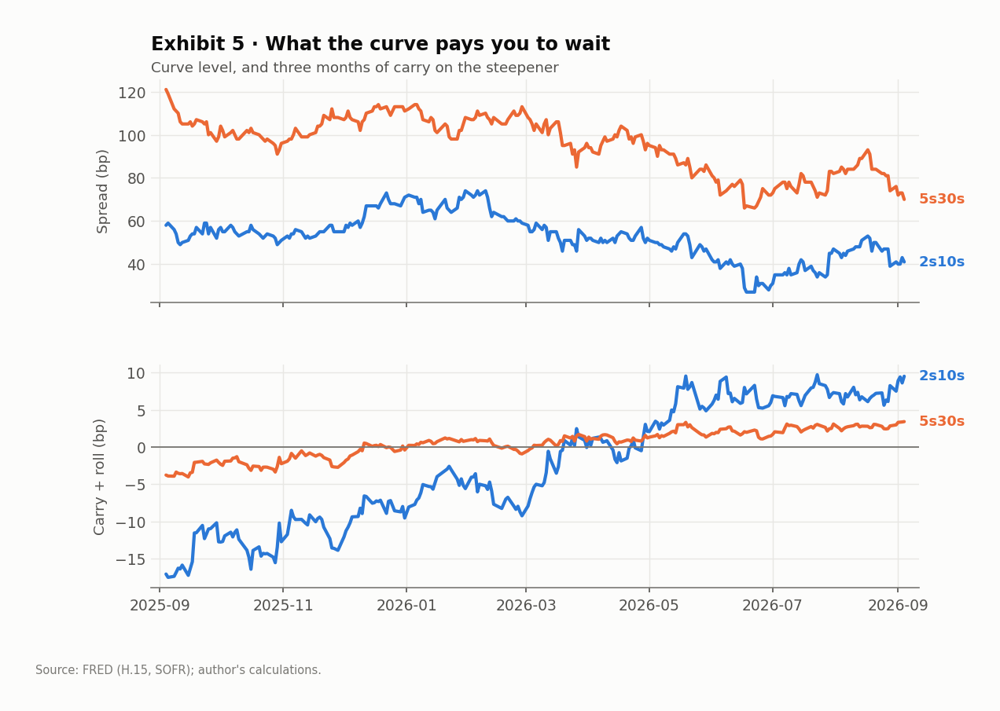
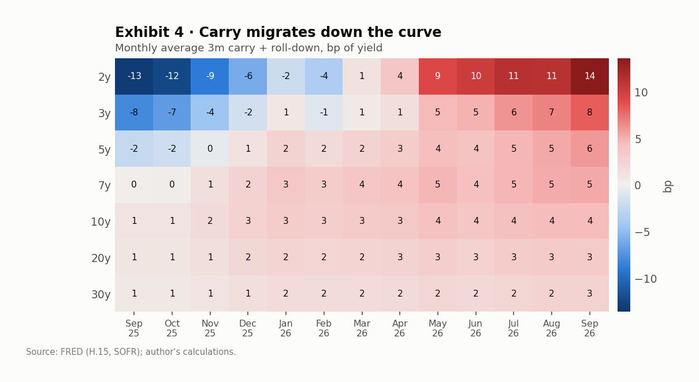
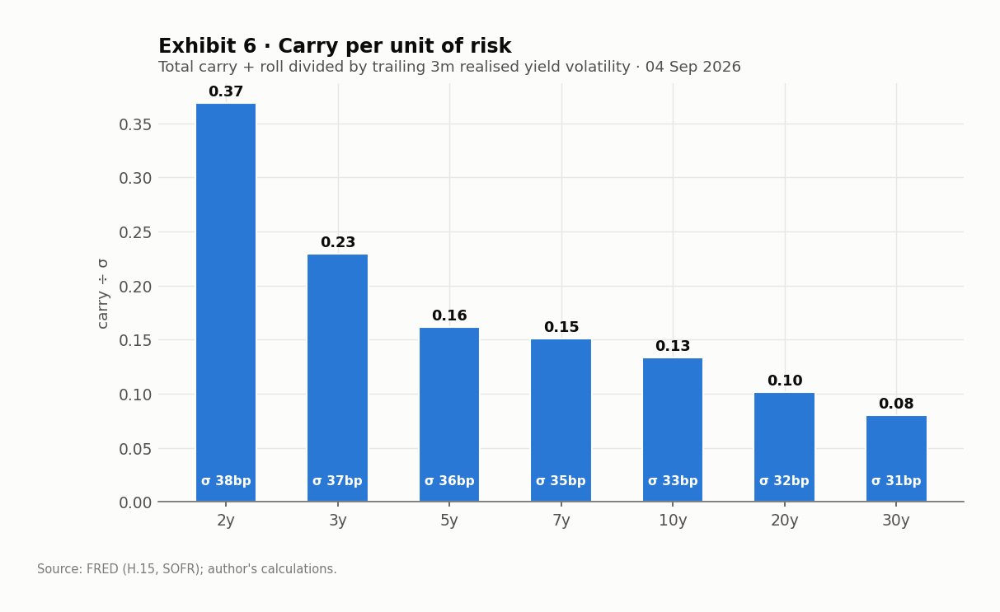

# US Treasury carry and roll-down

A small research toolkit that pulls the Treasury constant-maturity curve from
FRED, strips a zero curve out of it, and computes **carry and roll-down** on
repo-financed cash Treasuries across the curve — for a single day, and as a
daily history so you can see how the trade has changed.

Everything is reproducible from a clean checkout: one public data source, no API
key, no vendor terminal.



---

## Quick start

```bash
pip install -r requirements.txt
python run.py --refresh          # pull fresh data, rebuild every exhibit
python run.py --years 2          # longer history, cached data
python run.py --horizon 0.5      # 6-month holding period instead of 3
python test_rates.py             # 16 self-checks on the maths
```

Charts and tables land in `output/`; `output/summary.md` is regenerated on every
run with the current numbers.

---

## What "carry and roll-down" means here

The trade being measured is the simplest one on a rates desk: **buy the current
par bond at some tenor, finance it in repo, hold it for three months, sell it.**
The question is how much yields can rise before that stops being profitable.

Two horizon prices answer it.

**The forward price** `P_fwd` is the breakeven. It comes from cash-and-carry:
pay 100 today, fund at repo, collect any coupon along the way, deliver the bond
at the horizon. Sell at exactly this price and the trade repays its financing
and no more.

**The unchanged-curve price** `P_unch` is what the bond is actually worth in
three months if the *spot* curve does not move — the same yield-by-maturity
function applied to a bond that is now three months shorter. A 10y bond becomes
a 9.75y bond and gets priced off the 9.75y point.

The gap between the two is the entire P&L. Converting both prices back to yields
on the seasoned bond makes the decomposition **exact**, not an approximation:

```
roll-down  =  y_spot  −  y_unch      the bond ages into a different point on the curve
carry      =  y_fwd   −  y_spot      coupon income net of repo cost
─────────────────────────────────
total      =  y_fwd   −  y_unch   ≡  carry + roll-down
```

Positive numbers always favour the holder. A 10y at +4.5bp means yields can back
up 4.5bp over the quarter before the position underperforms its funding.

The same figure is reported in price terms as `excess_ret_bp`. The two tie out
through DV01 to within convexity — which is checked, not assumed
(`test_excess_return_ties_to_the_yield_number`).

### Two scenarios, and why the distinction is the whole point

It is tempting to think that funding at the curve's own implied rate should make
carry vanish. On a flat curve it does. On a sloped curve it does **not**, and the
reason is the difference between the two horizon prices above: *"forwards are
realised"* and *"the spot curve doesn't move"* are different states of the world.
An upward-sloping curve pays a financed long simply for sitting still, and that
payment is what carry and roll measure. `test_sloped_curve_pays_even_at_
breakeven_funding` pins this down.

---

## Methodology

### Data

| Series | Use |
| --- | --- |
| `DGS1MO … DGS30` (H.15 CMT) | par yield curve, 11 tenors |
| `SOFR` | financing rate for the repo leg |

Pulled from the public `fredgraph.csv` endpoint and cached to `data/`. Rows are
kept only where the 2y–30y curve printed in full; single-series gaps are
forward-filled up to five days.

### Bootstrap

CMT quotes are **par** yields, so they need stripping before anything can be
discounted properly.

1. Interpolate the nine usable par points (0.5, 1, 2, 3, 5, 7, 10, 20, 30y) onto
   a semiannual grid with a **PCHIP** spline. Shape-preserving and monotone
   between knots — a natural cubic spline invents humps in the 10y–20y gap on a
   curve this steep, and those humps show up as fake roll-down.
2. Strip discount factors one coupon date at a time:

   ```
   DF(0.5) = 1 / (1 + c₁/2)
   DF(tₙ)  = [1 − (cₙ/2)·Σᵢ₍ᵢ₌₁,ₙ₋₁₎ DF(tᵢ)] / (1 + cₙ/2)
   ```

3. Off-grid discount factors are log-linear in time — equivalently, piecewise
   constant instantaneous forwards.

The check that matters: every input par yield must reprice its own bond to
exactly 100. It does, to 1e-9.



### Funding

Repo accrues **simple interest, act/360**. A bond yield compounds
**semiannually, act/act**. These are not the same thing, and on a flat curve
funded at exactly the coupon rate the mismatch alone still bleeds ~1.5bp at the
2y. `implied_repo()` returns the money-market rate that genuinely zeroes the
curve out, and the gap between it and SOFR is a funding-richness read in its own
right.

---

## What the data said on 4 September 2026

Numbers below regenerate into `output/summary.md`; the narrative is the part
worth reading.

**Carry has migrated from the long end to the front end over the past year.**
Twelve months ago the 2y cost you 16bp a quarter to hold — the front end was
inverted against repo, and financing ate the coupon. Today it pays 14bp, the
richest point on the curve, and it does so on both raw and risk-adjusted
measures. That is a 30bp round trip in the economics of the same trade, driven
by the front end disinverting rather than by anything at the long end.



| Tenor | Yield | Carry | Roll | **Total** | Excess ret. | Mod. dur. |
| ---: | ---: | ---: | ---: | ---: | ---: | ---: |
| 2y | 4.37% | 9.7 | 4.3 | **14.0** | 23.4 | 1.90 |
| 3y | 4.45% | 7.1 | 1.5 | **8.5** | 21.9 | 2.78 |
| 5y | 4.54% | 4.8 | 1.1 | **5.9** | 24.8 | 4.43 |
| 7y | 4.65% | 4.0 | 1.3 | **5.3** | 30.3 | 5.92 |
| 10y | 4.78% | 3.4 | 1.1 | **4.5** | 34.5 | 7.88 |
| 20y | 5.25% | 3.1 | 0.1 | **3.2** | 39.3 | 12.29 |
| 30y | 5.24% | 2.5 | −0.1 | **2.4** | 36.6 | 15.04 |

*bp of yield over a 3-month horizon; SOFR 3.65%.*

Three things worth flagging:

- **Carry, not roll, is doing the work.** With SOFR 26bp below the curve-implied
  3m breakeven repo, every tenor carries positively — but roll-down contributes
  barely a basis point past the 5y, because the curve is nearly flat from 10y
  out. The 30y actually rolls *up*: 30y par sits a basis point through 20y, so
  the bond ages into a slightly higher yield. Small, but the right sign, and a
  curve fitter that smoothed the long end would have hidden it.

- **Steepeners are the trades getting paid.** With the front end carrying best,
  a DV01-neutral 2s10s steepener earns **+9.5bp** a quarter and 5s30s **+3.4bp**:
  the spread can flatten by that much before the position stops beating its
  financing. A year ago the same steepener *cost* **17bp** to hold, because the
  2y then carried 16bp worse than it does today. The exhibit below is that sign
  flip. Spreads are quoted as the steepener throughout and flies as long-belly;
  the convention is pinned to a first-principles P&L in
  `test_steepener_sign_matches_pnl`, because it is the easiest number here to
  state backwards.

- **Risk-adjusted, the front end wins by more, not less.** Trailing realised
  yield vol is 38bp at the 2y against 31bp at the 30y — a 1.2x spread against a
  5.7x spread in carry. The 2y earns 0.37x its quarterly vol; the 30y, 0.08x.







---

## What a desk would do differently

Stating the gaps is more useful than pretending there aren't any.

- **Par bonds, not on-the-runs.** Every tenor is modelled as a fresh par bond
  with a coupon equal to the CMT yield. Real benchmarks are seasoned, trade away
  from par, and carry a specialness premium in repo. That premium is the single
  biggest omission here: it can be worth several basis points at the 10y and it
  moves in ways the GC rate does not.

- **General collateral funding.** SOFR stands in for term repo. A desk would use
  the actual term GC rate, and for on-the-runs the *special* rate — which would
  raise front-end carry further, since the richest issues fund cheapest.

- **Fitted from quotes, not prices.** A production curve is fitted to observed
  bond prices (Nelson-Siegel-Svensson, or a spline with a smoothness penalty),
  which lets the fit disagree with any single quote. Bootstrapping straight
  through the CMT points takes each one as gospel.

- **Curve risk isn't modelled.** Carry and roll say what happens if the curve
  sits still. They say nothing about whether it will, and the historical
  distribution of quarterly curve moves dwarfs every number in the table above.
  Exhibit 6 is a first pass at scaling for that, not an answer to it.

- **No TIPS, agency or SSA.** Cash nominals only.

---

## Files

| | |
| --- | --- |
| `fred.py` | FRED access and caching |
| `curve.py` | par→zero bootstrap, bond pricing, duration |
| `carry.py` | carry/roll decomposition, spread and fly carry, breakeven repo |
| `run.py` | builds every exhibit and table |
| `test_rates.py` | 16 assert-based self-checks |
| `output/summary.md` | current numbers, regenerated each run |

The tests are the part to read first if you want to know whether to trust the
numbers. They cover the bootstrap (flat curve in, flat curve out; par bonds
reprice to 100), the pricing (yield round-trip, analytic duration against a 1bp
bump), and the carry maths (the decomposition sums exactly; cash-and-carry at
the curve's implied repo reproduces the curve's own forward prices; signs behave
when funding is moved either side of the coupon; and the steepener sign is
checked against an explicitly constructed DV01-neutral P&L rather than against
another formula).
